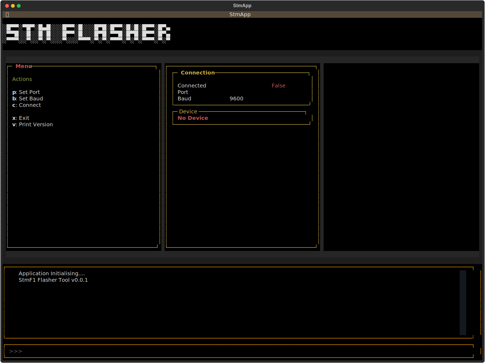
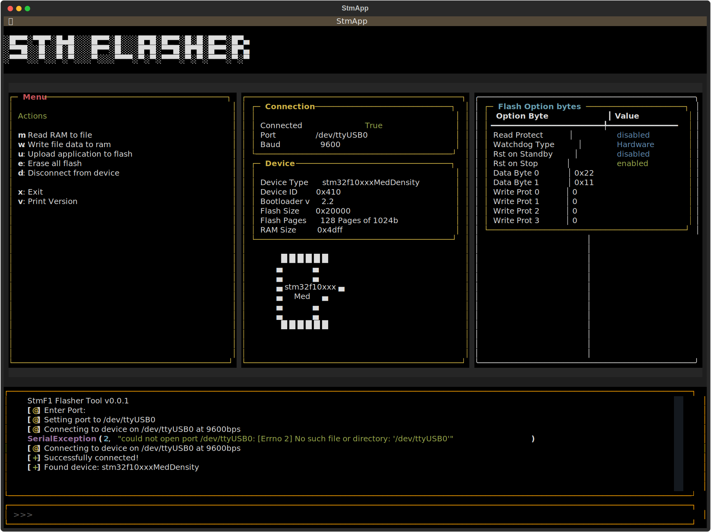

# STM32F1_Serial_Flasher
A python module for exploring STM32 F1 devices using the STM Bootloader's Serial interface

Some Planning...

SerialTool is the low-level bootloader interface to the device (via PySerial object)

DeviceDescriptor describes the connected device's characteristics after reading

StmDevice is the higher level functional class allowing user to do more complex operations without worrying about the low-level implementation

            +--------------------+
            |   StmDevice        |
            |   - read, write    |
            |   - program        |
            |   - erase flash    |
            +--------------------+
                    |
                    | 
                    |
        -----------------------------------
        |                                 |
        |                                 |
    +--------------+                +-------------+
    | SerialTool   |                | DeviceDescr |
    | - BL commands|                | - Type      |
    | - Serial Ifc |                | - ValidCmds |
    |              |                | - Flash sz  |
    +--------------+                +-------------+

This tool should be written with unittests - these unittests are run against the actual device. Because it's fun. And reduces the chances of making an error in the mock, or interpreting the Datasheet. Or Errata in the datasheet. Or writing tests for an invalid bootloader version. 

SerialFlasher Class
This class represents the object used to interface with the microcontroller.

## Refactor/TODOs

### Round 1

Trying to do everything in a single class again! Project structure needs some thinking about

High Level Commands: 
Write data to flash storage
Get device information
Get device status, etc

Mid level commands:
Send Bootloader commands
Check Bootloader responses
Configure driver
Read registers
Write registers

Low level commands:
read bytes
write bytes
wait for ack
reset with DTR

### Round 2
Todos
- Separate App and Module, obvs. Fun took over!
- Update/Upgrade comments to DoxyGen & make docs
- Relocate tests folder & create proper python module
- Build into a package & test
- Rename files/classes sensibly
- Format & use pep8 checker
- Watch for proper case use!

## Notes

Flash programming is gonna be fun! After reset, FPEC block is protected FLASH_CR not accessible in write mode two write cycles to unlock
-   1 : Key1 -> FLASH_KEYREG
-   2 : Key2 -> FLASH_KEYREG

__this isn't required for using the bootloader__

| Memory Area | Write command | Read command | Erase command | Go command |
| ----------- | ------------- | ------------ | ------------- | ---------- |
| Flash | Supported | Supported | Supported | Supported |
| RAM | Supported | Supported | Not supported | Supported |
| System Memory | Not supported |Supported | Not supported | Not supported |
| Data Memory | Supported | Supported | Not supported | Not supported |
| OTP Memory | Supported | Supported | Not supported | Not supported |

Device Model  - high level, abstracted user-friendly methods
Bootloader Interface - mid level, sanity checking, device controller
Serial interface - low level, serial port interface, timeouts etc

Flash memory programming sequence in standard mode:
- check no flash mem operation (see BSY bit in FLASH_SR)
- set the PG bit in FLASH_SR
- perform the 16-bit write at desired address
- wait for BSY bit to be unset
- read the programmed value & verify

Programming the option bytes:
- write KEYS 1 & 2 to the FLASH_OPTKEYR register to set the OPTWRE bit in the FLASH_CR
- check no flash mem operation as above
- set the OPTPG bit in the FLASH_CR
- write the 16-bit value to desired address
- wait for BSY to be unset & verify

Erasing the option bytes:
- unlock the OPTWRE bit in the FLASH_CR as above
- set the OPTER bit in the FLASH_CR
- set the STRT but in the FLASH_CR
- wait for BSY & verify

### Application

The application is built with Textual. Pretty fun to use and looks really nice.

 

