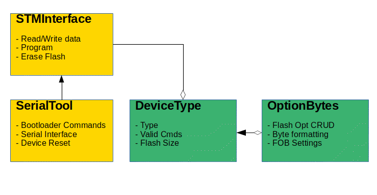

# STM32F1_Serial_Flasher
A python module for exploring STM32 F1 devices using the STM Bootloader's Serial interface

## Brief

This tool uses PySerial to interface with an STM32F1 board using a cheap serial to USB converter tool (or the on-board serial->usb chip if present) in order to speak to the device's bootloader. From there the user can read and write flash memory, lock and unlock read/write access to memory regions and get device information.

The module's functionality is split over several classes. The SerialTool class controls the low-level serial interface with the device, sending bootloader handshakes, connecting, sending bootloader commands, handling checksums and receiving raw bytes in response.

The DeviceType class is a data structure used to hold information about the connected device, taken largely from the STM32F10X datasheet. Their is also an OptionBytes class which helps create a model of the option bytes - these contain some useful device functionality, but have to be handled correctly. The OptionBytes class helps to read or write raw option bytes to/from the device, simplifying the process. The OptionBytes object is stored as an attribute of DeviceType, and is populated using a 16-byte bytearray or setting the attributes manually. 

The StmInterface class is a higher level interaction which uses the SerialTool class to interact with the device and building a DeviceType model of the device. This class allows reading device settings, mass erasing flash pages, writing applications to flash/ram, configuring the device's option bytes and reading program data from the flash.

## Usage

### Setup

The SerialTool class uses PySerial to interact with the bootloader on the target device. The bootloader uses a USART protocol to communicate with the bootloader, which differs from traditional USB signaling. To communicate over USART with a device we need a USB->UART adaptor. Some development boards may have this adaptor IC on the board already, in which case no external hardware is required. These adaptors are very cheap and available from a number of sources ([Example](https://www.adafruit.com/product/5335)). STM32F10xxx device's primary UART port uses Port A9 for Tx and Port A10 for Rx. These should connect to the Rx and Tx pins (i.e Rx to Tx, Tx to Rx) of the USB->UART adaptor. The adaptor should also supply power (or at the very least share a ground with) the target device. Finally, in order to reset the device, the SerialTool class utilises the DTR pin of the adaptor ( unfortunately not all adaptors make this pin available to the user) which should be connected to the device's reset pin.

### SerialTool

SerialTool init requires either a configured PySerial object or a string containing the serial port to connect to. If neither is supplied then the instantiation will raise an error. The baud rate of the connection is 9600bps by default, however this can be changed by the user. The supported baud rates are 1200 - 115200 bps. 

#### Timeouts
Serial read/write timeouts are controlled by the underlying Serial object. They can be configured by accessing that object (i.e if supplying a serial object to the tool on instantiation) or by using the `setSerialReadWriteTimeout` method. The timeout default is 1 second, however at slower baud rates, this is insufficient. For example, reading 256 bytes (the maximum read/write length) at 1200 baud will take approximately 1.7 seconds. If using a very low baud rate, the user should remember to set the timeouts accordingly.

The SerialTool class provides methods for calling each of the available bootloader commands and returns the raw bytes to the user. This class does not verify user supplied information - for example addresses are not confirmed to be accessible. This provides a lot of flexibility regarding how the user interacts with the device, but obviously does not provide a safety net. It is unlikely that any of the bootloader commands would be capable of damaging or bricking the device but all operations are undertaken at the user's own risk :)

#### Device resets
Several bootloader commands are used to adjust the flash option bytes register (e.g read/write protect/unprotect of flash pages). The commands will cause a device reset, as will all writes to the Flash Option Bytes memory region (writes to this region are only permitted if they are 16 bytes in length). The user will need to call the `reconnect` method after these commands. See documentation for more info.

### STMInterface

This class provides a higher level control of the device, simplifying reading and writing large blocks of information, retrieving device information and doing sensible checks of addresses and input lengths. The STMInterface can also reconnect automatically after the device resets.

The DeviceType model provides specific information about the device, including bootloader version, device ID, memory sizes and addresses, even flash page addresses. This model is used to validate addresses by the STMInterface class. 

The OptionBytes model provides a way to generate a data model from the raw flash option bytes content, and also allows the user to create a model from the attributes they wish to set, or modify the existing configuration and creating a new valid set bytes to write to the flash option byte registers. It also makes the single-bit settings easier to handle.

### Picture to add some colour

## Tests

This tool is written with unittests - for the SerialTool and STMInterface tests, these unittests are run against the actual device. Because it's fun. And reduces the chances of making an error in the mock, or interpreting the Datasheet. Or Errata in the datasheet. Or writing tests for an invalid bootloader version. More tests on the todo list. 

## Supported Devices

All STM32F10Xxx devices should be supported
- stm32f10xxxLowDensity
- stm32f10xxxMedDensity
- stm32f10xxxHighDensity
- stm32f10xxxMedDensityValueLine
- stm32f10xxxHighDensityValueLine
- stm32f10xxxXlDensity

## Refactor/TODOs

### Round 1

Todos
- ~~Trying to do everything in a single class again! Project structure needs some thinking about~~

### Round 2

Todos
- ~~Separate App and Module, obvs. Fun took over!~~
- ~~Update/Upgrade comments to Sphinx & make docs~~
- ~~Relocate tests folder & create proper python module~~
- ~~Build into a package & test~~
- ~~Rename files/classes sensibly~~
- Format & use pep8 checker
- Watch for proper case use!
- Write more extensive tests

### Round 3

Todos
- Rename project (It's quite numbery)
- Fix directory structure
- Use UART printing image to test application upload

## Bootloader Memory Access

| Memory Area | Write command | Read command | Erase command | Go command |
| ----------- | ------------- | ------------ | ------------- | ---------- |
| Flash | Supported | Supported | Supported | Supported |
| RAM | Supported | Supported | Not supported | Supported |
| System Memory | Not supported |Supported | Not supported | Not supported |
| Data Memory | Supported | Supported | Not supported | Not supported |
| OTP Memory | Supported | Supported | Not supported | Not supported |

## Notes

__this isn't required for using the bootloader__

Flash programming is gonna be fun! After reset, FPEC block is protected FLASH_CR not accessible in write mode two write cycles to unlock
-   1 : Key1 -> FLASH_KEYREG
-   2 : Key2 -> FLASH_KEYREG

Flash memory programming sequence in standard mode:
- check no flash mem operation (see BSY bit in FLASH_SR)
- set the PG bit in FLASH_SR
- perform the 16-bit write at desired address
- wait for BSY bit to be unset
- read the programmed value & verify

Programming the option bytes:
- write KEYS 1 & 2 to the FLASH_OPTKEYR register to set the OPTWRE bit in the FLASH_CR
- check no flash mem operation as above
- set the OPTPG bit in the FLASH_CR
- write the 16-bit value to desired address
- wait for BSY to be unset & verify

Erasing the option bytes:
- unlock the OPTWRE bit in the FLASH_CR as above
- set the OPTER bit in the FLASH_CR
- set the STRT but in the FLASH_CR
- wait for BSY & verify

## Sources And Documentation

Good documentation available on the STM Website. Special shoutout to the following documents:

- __AN2606__ STM32 Microcontroller system memory boot mode
- __AN3155__ USART protocol used in the STM32 bootloader
- __PM0075__ STM32F10xxx Flash memory microcontrollers